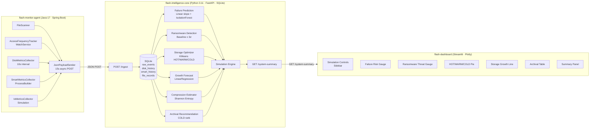

# Flash Intelligence Platform — Architecture

## Component Map



## Data Flow

```
1. Java Agent collects every 15 seconds:
   ┌────────────────┐
   │ FileScanner    │  path, size, timestamps, extension
   │ AccessTracker  │  accessCount, writeCount, renameCount
   │ DiskCollector  │  total, used, free bytes
   │ SmartCollector │  wear, reallocated, powerOnHours, temp, media_errors
   │ IoCollector    │  readIOPS, writeIOPS, burstWriteRate (simulated)
   └────────────────┘
           │  POST /ingest  (JSON ~15KB per cycle)
           ▼
2. Python Core ingests and stores in SQLite tables:
   raw_events, disk_history, smart_history, io_history, file_records
           │  GET /system-summary
           ▼
3. Intelligence modules run on live DB data:
   failure_prediction   → failure_risk_score, remaining_life_days
   ransomware_detection → threat_score
   storage_optimizer    → HOT/WARM/COLD per file
   growth_forecast      → days_to_90pct_full
   compression_estimator→ savings_bytes, ratio
   archival_recommendation → ranked COLD candidates
   simulation_engine    → projected capacity, wear, lifespan
           │  JSON response
           ▼
4. Streamlit Dashboard renders live panels with auto-refresh
```

## Configuration Hierarchy

```
config/                   (shared reference, not parsed at runtime)
flash-monitor-agent/
  application.yml         ← Java agent settings (scan root, intervals, device)
flash-intelligence-core/
  config.yaml             ← ML weights, thresholds, DB path, archival rules
flash-dashboard/
  config.yaml             ← API URL, refresh interval, color theme
```

## SQLite Schema

| Table | Purpose | Key columns |
|-------|---------|-------------|
| `raw_events` | Full payload archive | `ts`, `payload` (JSON) |
| `disk_history` | Capacity time series | `ts`, `total_bytes`, `used_bytes` |
| `smart_history` | SMART time series | `ts`, `wear_leveling_count`, `temperature`, … |
| `io_history` | I/O time series | `ts`, `write_iops`, `burst_write_rate`, `rename_count` |
| `file_records` | Latest per-file state | `path` (PK), `size`, `access_count`, `write_count` |
